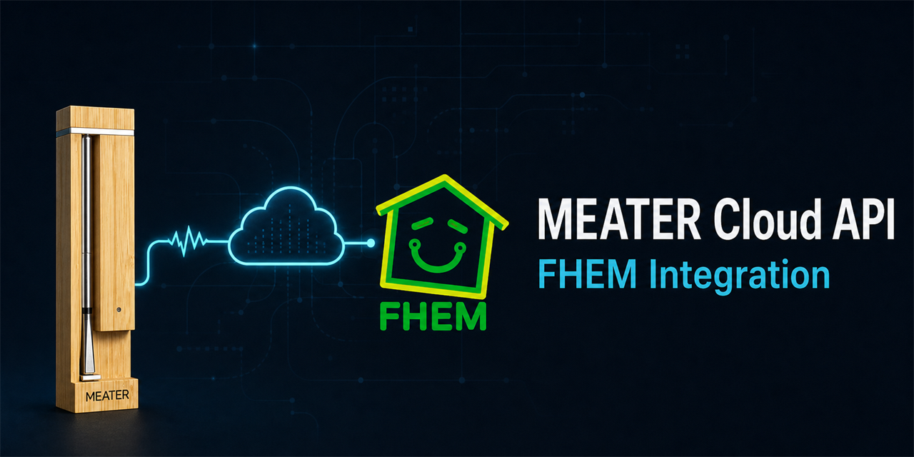

# MEATER Cloud API for FHEM



[](https://github.com/TeeVau/fhem-MeaterCloudAPI/releases)
[](LICENSE)

Reproduzierbare FHEM-Integration eines einzelnen MEATER Pro über die öffentliche
MEATER Cloud REST API. Die Implementierung bleibt vollständig innerhalb von
FHEM: `HTTPMOD` übernimmt Login und Polling, drei Funktionen in
`99_myUtils.pm` bereiten die Daten auf und ein kompaktes `DOIF` erkennt
Ereignisse.

Der Stand `v0.1.0` ist für erfahrene FHEM-Anwender und Maker gedacht. Es gibt
keinen Installer und kein eigenes FHEM-Modul. Die Konfiguration wird bewusst
manuell übernommen und an die lokale Installation angepasst.

## Eigenschaften

- JWT-Login über HTTPMOD mit lokalem FHEM-Key-Value-Speicher
- direkter Abruf eines einzelnen Geräts im 60-Sekunden-Intervall
- explizite JSON-Pfade statt dauerhaftem `extractAllJSON`
- kompakte mehrzeilige Anzeige über `stateFormat`
- sichere Kennzeichnung veralteter Cloud-Daten
- neutrale Anzeige ohne alte Temperaturen bei getrenntem, inaktivem Fühler
- einmalige Logereignisse pro Cook-ID
- vollständiger Ausschluss aus DbLog
- keine Steuerung des MEATER, Grills oder Ofens
- keine externen Bridges, MQTT-Dienste oder blockierenden HTTP-Aufrufe

## Status und Grenzen

Die öffentliche MEATER-API ist als Beta gekennzeichnet. API-Zustände und
Cook-Lebenszyklus können von der App-Darstellung abweichen. Im Live-Test blieb
ein gestarteter Cook beispielsweise im API-State `Configured`; die laufende
Zeit in `elapsedSeconds` war deshalb das belastbare Startsignal.

`v0.1.0` unterstützt genau einen MEATER Pro. Mehrere Fühler, historische Cooks,
Plots, TTS, Alexa und Pushover gehören nicht zum Umfang dieses Releases.

## Voraussetzungen

- FHEM mit `HTTPMOD` und `DOIF`
- ein MEATER-Cloud-Konto
- ein in der Cloud sichtbarer MEATER Pro
- die Geräte-ID aus `GET /v1/devices`
- eine vorhandene `99_myUtils.pm`
- `use POSIX qw(strftime);` in `99_myUtils.pm`

## Installation

### 1. Zugangsdaten lokal speichern

Die Befehle ausschließlich in der eigenen FHEM-Instanz ausführen. Ausgefüllte
Befehle, JWTs, Geräte-IDs und Cook-IDs gehören weder in Git noch in Support-
Ausgaben.

```text
{storeKeyValue("meater_email","MEATER_EMAIL")}
{storeKeyValue("meater_password","MEATER_PASSWORD")}
```

Die Geräte-ID wird absichtlich nicht über `storeKeyValue` verwaltet. Sie wird
direkt in der HTTPMOD-URL anstelle von `DEVICE_ID` eingesetzt.

### 2. HTTPMOD anlegen

```text
defmod MeaterCloud HTTPMOD https://public-api.cloud.meater.com/v1/devices/DEVICE_ID 60
attr MeaterCloud enableControlSet 1
attr MeaterCloud enforceGoodReadingNames 1
attr MeaterCloud timeout 10
attr MeaterCloud requestHeader01 Authorization: Bearer $sid
attr MeaterCloud requestHeader02 Accept-Language: de
attr MeaterCloud reAuthRegex "statusCode"\s*:\s*401
attr MeaterCloud sid1URL https://public-api.cloud.meater.com/v1/login
attr MeaterCloud sid1Header01 Content-Type: application/json
attr MeaterCloud sid1Data {"email":"%%meater_email%%","password":"%%meater_password%%"}
attr MeaterCloud sid1IdJSON data_token
attr MeaterCloud replacement01Regex %%meater_email%%
attr MeaterCloud replacement01Mode key
attr MeaterCloud replacement01Value meater_email
attr MeaterCloud replacement02Regex %%meater_password%%
attr MeaterCloud replacement02Mode key
attr MeaterCloud replacement02Value meater_password
attr MeaterCloud DbLogExclude .*
```

Das Intervall von 60 Sekunden bleibt unter der offiziellen Empfehlung von
höchstens zwei Anfragen pro 60 Sekunden. `room`, `alias` und weitere reine
Darstellungsattribute bleiben installationsspezifisch.

### 3. Direkte Readings definieren

`extractAllJSON` wird nicht benötigt. Cook-Readings werden entfernt, sobald die
API keinen Cook-Block mehr liefert.

```text
attr MeaterCloud reading01JSON data_id
attr MeaterCloud reading01Name deviceId
attr MeaterCloud reading02JSON data_temperature_internal
attr MeaterCloud reading02Name internalTemperature
attr MeaterCloud reading03JSON data_temperature_ambient
attr MeaterCloud reading03Name ambientTemperature
attr MeaterCloud reading04JSON data_updated_at
attr MeaterCloud reading04Name updatedAt
attr MeaterCloud reading05DeleteIfUnmatched 1
attr MeaterCloud reading05JSON data_cook_id
attr MeaterCloud reading05Name cookId
attr MeaterCloud reading06DeleteIfUnmatched 1
attr MeaterCloud reading06JSON data_cook_name
attr MeaterCloud reading06Name cookName
attr MeaterCloud reading07DeleteIfUnmatched 1
attr MeaterCloud reading07JSON data_cook_state
attr MeaterCloud reading07Name cookState
attr MeaterCloud reading08DeleteIfUnmatched 1
attr MeaterCloud reading08JSON data_cook_temperature_target
attr MeaterCloud reading08Name targetTemperature
attr MeaterCloud reading09DeleteIfUnmatched 1
attr MeaterCloud reading09JSON data_cook_temperature_peak
attr MeaterCloud reading09Name peakTemperature
attr MeaterCloud reading10DeleteIfUnmatched 1
attr MeaterCloud reading10JSON data_cook_time_elapsed
attr MeaterCloud reading10Name elapsedSeconds
attr MeaterCloud reading11DeleteIfUnmatched 1
attr MeaterCloud reading11JSON data_cook_time_remaining
attr MeaterCloud reading11Name remainingSeconds
attr MeaterCloud reading12JSON status
attr MeaterCloud reading12Name apiStatus
attr MeaterCloud reading13JSON statusCode
attr MeaterCloud reading13Name apiStatusCode
```

### 4. myUtils-Funktionen ergänzen

Die folgenden drei Funktionen in `99_myUtils.pm` einfügen. `strftime` muss über
`use POSIX qw(strftime);` importiert sein.

<details>
<summary><code>myMeaterCloudUpdateReadings</code></summary>

```perl
sub myMeaterCloudUpdateReadings($) {
  my ($name) = @_;
  my $hash = $defs{$name};
  return 0 if (!$hash);

  my $cookState = ReadingsVal($name, "cookState", "");
  my $elapsedSeconds = ReadingsVal($name, "elapsedSeconds", "");
  my $cookActive = (
    $cookState =~ /^(Started|Ready For Resting|Resting|OVERCOOK!)$/
      || ($cookState eq "Configured" && $elapsedSeconds =~ /^\d+$/ && $elapsedSeconds > 0)
  ) ? 1 : 0;

  my %stateDE = (
    "Not Started"        => "nicht gestartet",
    "Configured"         => "konfiguriert",
    "Started"            => "läuft",
    "Ready For Resting"  => "bereit zum Ruhen",
    "Resting"            => "ruht",
    "Slightly Underdone" => "leicht untergart",
    "Finished"           => "fertig",
    "Slightly Overdone"  => "leicht übergart",
    "OVERCOOK!"          => "ÜBERGART",
  );
  my $cookStateDE = $stateDE{$cookState}
    // ($cookState ne "" ? $cookState : "kein Garvorgang");
  $cookStateDE = "läuft" if ($cookState eq "Configured" && $cookActive);

  my $updatedAt = ReadingsNum($name, "updatedAt", 0);
  my $dataAge = $updatedAt ? int(time() - $updatedAt) : -1;
  $dataAge = 0 if ($dataAge < 0);

  my $apiStatusCode = ReadingsNum($name, "apiStatusCode", 0);
  my $cloudState = "unavailable";
  $cloudState = "auth_error"   if ($apiStatusCode == 401);
  $cloudState = "rate_limited" if ($apiStatusCode == 429);
  $cloudState = "cloud_error"  if ($apiStatusCode >= 500);
  $cloudState = $dataAge > 180 ? "stale" : "online"
    if ($apiStatusCode == 200 && $updatedAt);

  my $target = ReadingsVal($name, "targetTemperature", "");
  my $internal = ReadingsVal($name, "internalTemperature", "");
  my $targetDelta = $target ne "" && $internal ne ""
    ? sprintf("%.1f", $target - $internal)
    : "";

  my $remainingSeconds = ReadingsVal($name, "remainingSeconds", "");
  my $remainingTime = "";
  my $estimatedFinish = "";
  if ($remainingSeconds ne "") {
    if ($remainingSeconds < 0) {
      $remainingTime = "wird berechnet";
    } else {
      my $hours = int($remainingSeconds / 3600);
      my $minutes = int(($remainingSeconds % 3600) / 60);
      $remainingTime = $hours > 0 ? "$hours h $minutes min" : "$minutes min";
      $estimatedFinish = strftime("%H:%M", localtime($updatedAt + $remainingSeconds))
        if ($remainingSeconds > 0 && $updatedAt);
    }
  }

  my $cookStartedAt = $updatedAt && $elapsedSeconds ne ""
    ? strftime("%Y-%m-%d %H:%M:%S", localtime($updatedAt - $elapsedSeconds))
    : "";

  readingsBulkUpdate($hash, "cookStateDE", $cookStateDE);
  readingsBulkUpdate($hash, "dataAge", $dataAge);
  readingsBulkUpdate($hash, "cloudState", $cloudState);
  readingsBulkUpdate($hash, "targetDelta", $targetDelta);
  readingsBulkUpdate($hash, "remainingTime", $remainingTime);
  readingsBulkUpdate($hash, "estimatedFinish", $estimatedFinish);
  readingsBulkUpdate($hash, "cookStartedAt", $cookStartedAt);

  return $cookActive;
}
```

</details>

<details>
<summary><code>myMeaterCloudStateFormat</code></summary>

```perl
sub myMeaterCloudStateFormat($) {
  my ($name) = @_;

  my $cloudState = ReadingsVal($name, "cloudState", "unavailable");
  my $updatedAt = ReadingsNum($name, "updatedAt", 0);
  my $dataAge = $updatedAt ? int(time() - $updatedAt) : -1;
  $dataAge = 0 if ($dataAge < 0);
  $cloudState = "stale" if ($cloudState eq "online" && $dataAge > 180);
  my $cookActive = ReadingsNum($name, "cookActive", 0);

  if ($cloudState eq "stale" && !$cookActive) {
    return "MEATER Pro – kein Garvorgang<br/>"
      . "Fühler nicht verbunden · letzte Cloud-Daten vor $dataAge s";
  }

  my $cloudLine = "Cloud: $cloudState · Datenalter: "
    . ($dataAge >= 0 ? "$dataAge s" : "unbekannt");
  if ($cloudState eq "stale") {
    $cloudLine = '<span style="display:inline-block; margin-top:4px; '
      . 'padding:4px 7px; border:2px solid #d00000; border-radius:4px; '
      . 'background:#ffe5e5; color:#b00000; font-weight:bold;">'
      . "⚠ DATEN VERALTET · Cloud: stale · Datenalter: $dataAge s</span>";
  }

  my $cookName = ReadingsVal($name, "cookName", "");
  my $cookStateDE = ReadingsVal($name, "cookStateDE", "kein Garvorgang");
  my $internal = ReadingsVal($name, "internalTemperature", "-");
  my $ambient = ReadingsVal($name, "ambientTemperature", "-");

  if ($cookName ne "") {
    my $target = ReadingsVal($name, "targetTemperature", "");
    my $remainingTime = ReadingsVal($name, "remainingTime", "");
    my $estimatedFinish = ReadingsVal($name, "estimatedFinish", "");

    my $text = "MEATER Pro – $cookName – $cookStateDE<br/>Kern: $internal °C";
    $text .= " · Ziel: $target °C" if ($target ne "");
    $text .= "<br/>Garraum: $ambient °C";
    $text .= "<br/>Restzeit: $remainingTime" if ($remainingTime ne "");
    $text .= " · fertig ca. $estimatedFinish Uhr" if ($estimatedFinish ne "");
    return "$text<br/>$cloudLine";
  }

  return "MEATER Pro – kein Garvorgang<br/>"
    . "Kern: $internal °C · Garraum: $ambient °C<br/>"
    . $cloudLine;
}
```

</details>

<details>
<summary><code>myMeaterCloudCheckEvents</code></summary>

```perl
sub myMeaterCloudCheckEvents($$) {
  my ($name, $eventName) = @_;
  my $eventHash = $defs{$eventName};
  return if (!$defs{$name} || !$eventHash);

  my $cookId = ReadingsVal($name, "cookId", "");
  if ($cookId eq "") {
    my $lastCookId = ReadingsVal($eventName, "lastActiveCookId", "");
    return if ($lastCookId eq "");

    my $lastCookName = ReadingsVal($eventName, "lastActiveCookName", "Garvorgang");
    if (ReadingsVal($eventName, "finishedCookId", "") ne $lastCookId) {
      Log3 $name, 3, "MEATER Cloud: $lastCookName: Garvorgang beendet";
      readingsSingleUpdate($eventHash, "finishedCookId", $lastCookId, 0);
    }
    readingsSingleUpdate($eventHash, "lastActiveCookId", "", 0);
    readingsSingleUpdate($eventHash, "lastActiveCookName", "", 0);
    return;
  }

  my $cookName = ReadingsVal($name, "cookName", "Garvorgang");
  my $cookState = ReadingsVal($name, "cookState", "");
  my $targetDelta = ReadingsVal($name, "targetDelta", "");
  my $updatedAt = ReadingsNum($name, "updatedAt", 0);
  my $dataAge = $updatedAt ? int(time() - $updatedAt) : -1;
  my $cookActive = ReadingsNum($name, "cookActive", 0);

  if ($cookActive) {
    readingsSingleUpdate($eventHash, "lastActiveCookId", $cookId, 0);
    readingsSingleUpdate($eventHash, "lastActiveCookName", $cookName, 0);
  }

  my @events = (
    ["targetWarnCookId",
      $cookActive
        && $targetDelta =~ /^-?\d+(?:\.\d+)?$/
        && $targetDelta > 0 && $targetDelta <= 5,
      "$cookName: Zieltemperatur fast erreicht ($targetDelta °C verbleibend)"],
    ["readyCookId",
      $cookState eq "Ready For Resting",
      "$cookName: bereit zum Ruhen"],
    ["finishedCookId",
      $cookState eq "Finished",
      "$cookName: Garvorgang beendet"],
    ["overcookCookId",
      $cookState eq "OVERCOOK!",
      "$cookName: ÜBERGART"],
    ["staleCookId",
      $cookActive && $dataAge > 180,
      "$cookName: Cloud-Daten seit $dataAge Sekunden veraltet"],
  );

  for my $event (@events) {
    my ($reading, $condition, $message) = @$event;
    next if (!$condition || ReadingsVal($eventName, $reading, "") eq $cookId);
    Log3 $name, 3, "MEATER Cloud: $message";
    readingsSingleUpdate($eventHash, $reading, $cookId, 0);
  }
}
```

</details>

### 5. Funktionen aktivieren

```text
attr MeaterCloud userReadings cookActive {myMeaterCloudUpdateReadings($name)}
attr MeaterCloud stateFormat {myMeaterCloudStateFormat($name)}
reload 99_myUtils.pm
```

### 6. Ereignisprüfung anlegen

Der ausgerichtete Minutentimer erkennt ausbleibende Cloud-Updates auch dann,
wenn kein neues HTTPMOD-Event eintrifft. Die Funktion sperrt jede Meldungsart
über die aktuelle Cook-ID gegen Wiederholungen.

```text
defmod doif_MeaterCloudEvents DOIF ([MeaterCloud:updatedAt] or [+:01]) ({myMeaterCloudCheckEvents("MeaterCloud","doif_MeaterCloudEvents")})
attr doif_MeaterCloudEvents do always
attr doif_MeaterCloudEvents DbLogExclude .*
```

Nach erfolgreicher Prüfung:

```text
save
```

## Reading-Modell

| Gruppe | Readings |
| --- | --- |
| Gerät | `deviceId`, `internalTemperature`, `ambientTemperature`, `updatedAt` |
| Cook | `cookId`, `cookName`, `cookState`, `targetTemperature`, `peakTemperature`, `elapsedSeconds`, `remainingSeconds` |
| API | `apiStatus`, `apiStatusCode` |
| Abgeleitet | `cookActive`, `cookStateDE`, `cloudState`, `dataAge`, `targetDelta`, `remainingTime`, `estimatedFinish`, `cookStartedAt` |

## Zustands- und Ereignislogik

| Situation | Anzeige / Verhalten |
| --- | --- |
| verbunden, kein Cook | aktuelle Temperaturen und `Cloud: online` |
| gestartet, API-State `Configured`, `elapsedSeconds > 0` | `cookActive = 1`, Anzeige `läuft` |
| aktiver Cook, Daten älter als 180 s | rote Stale-Warnbox und einmalige Logmeldung |
| Wiederverbindung | automatische Rückkehr zu `Cloud: online` |
| Cook-Block verschwindet nach aktivem Cook | einmalige Abschlussmeldung |
| getrennt, kein aktiver Cook | neutrale Meldung ohne veraltete Temperaturen |

Pro Cook-ID werden höchstens folgende Ereignisse protokolliert:

- höchstens 5 °C bis zur Zieltemperatur
- `Ready For Resting`
- `Finished` oder das bestätigte Verschwinden des aktiven Cook-Blocks
- `OVERCOOK!`
- Messwerte länger als 180 Sekunden veraltet

## Validierungsstand

Live mit einem MEATER Pro und HTTPMOD 4.2.0 geprüft:

- Login, JWT-Erneuerung und 60-Sekunden-Polling
- Cook-Start trotz API-State `Configured`
- Active-Cook-Merker und Wiederholungssperren
- aktive Verbindung → stale → Wiederverbindung
- genau eine Stale-Meldung während des Test-Cooks
- genau eine Abschlussmeldung nach dem Test-Cook
- neutraler Offline-Zustand ohne alte Temperaturen
- keine Einträge für `MeaterCloud` in DbLog

Noch nicht gezielt live beobachtet wurden die Ereignisse bei 5 °C
Restdifferenz, `Ready For Resting` und `OVERCOOK!`. Sie sollten während eines
normalen Garvorgangs validiert und nicht künstlich provoziert werden.

## Fehlerdiagnose

| Symptom | Prüfpunkte |
| --- | --- |
| HTTP 401 / `auth_error` | lokale Keys, Login-Antwort, `sid1IdJSON`, erneute Anmeldung |
| HTTP 429 / `rate_limited` | Pollingintervall und weitere Clients desselben Kontos |
| HTTP 5xx / `cloud_error` | MEATER-Cloud; alte Daten nicht als aktuell interpretieren |
| Gerät fehlt | Bluetooth- und Cloud-Verbindung der App, Konto, einmalig abgeschlossener Cloud-Cook |
| `stale` bei aktivem Cook | App-/Block-Verbindung und Fortschritt von `updatedAt` |
| kein Cook vor App-Start | erwartetes Verhalten; die API liefert noch keinen Cook-Block |

## Sicherheit und Datenschutz

- Das Repository enthält keine E-Mail-Adresse, kein Passwort, kein JWT, keine
  reale Geräte-ID und keine Cook-ID.
- `storeKeyValue` wird nur für E-Mail-Adresse und Passwort verwendet.
- Die Geräte-ID steht lokal in der HTTPMOD-URL und darf nicht veröffentlicht
  werden.
- `DbLogExclude .*` ist für HTTPMOD und DOIF gesetzt.
- Das Projekt ist rein lesend und darf nicht zur sicherheitskritischen
  Grill-/Ofensteuerung erweitert werden.

## Lizenz

Veröffentlicht unter der [MIT-Lizenz](LICENSE). MEATER und MEATER Pro sind
Marken ihrer jeweiligen Rechteinhaber. Dieses Projekt ist nicht mit Apption
Labs verbunden oder von Apption Labs unterstützt.

## Quellen

- [MEATER Cloud REST API](https://github.com/apption-labs/meater-cloud-public-rest-api)
- [FHEM HTTPMOD](https://wiki.fhem.de/wiki/HTTPMOD)
- [FHEM DOIF](https://fhem.de/commandref_DE.html#DOIF)
